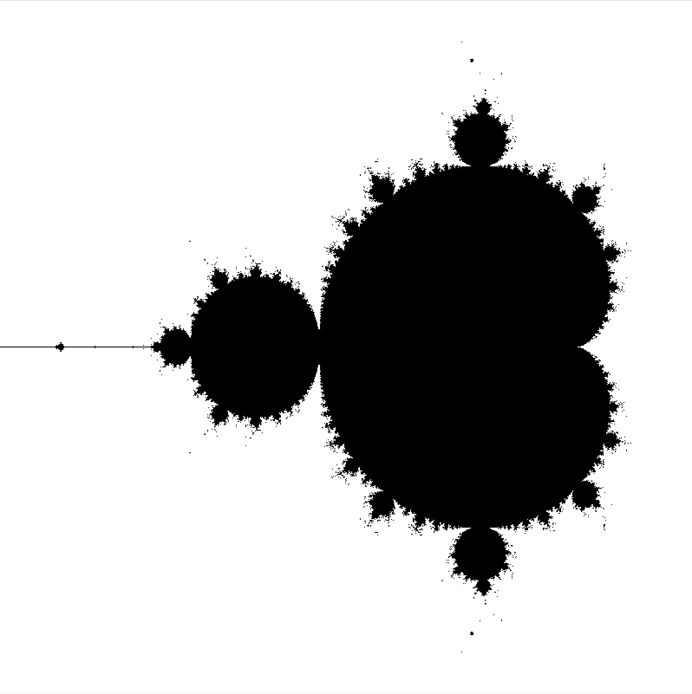
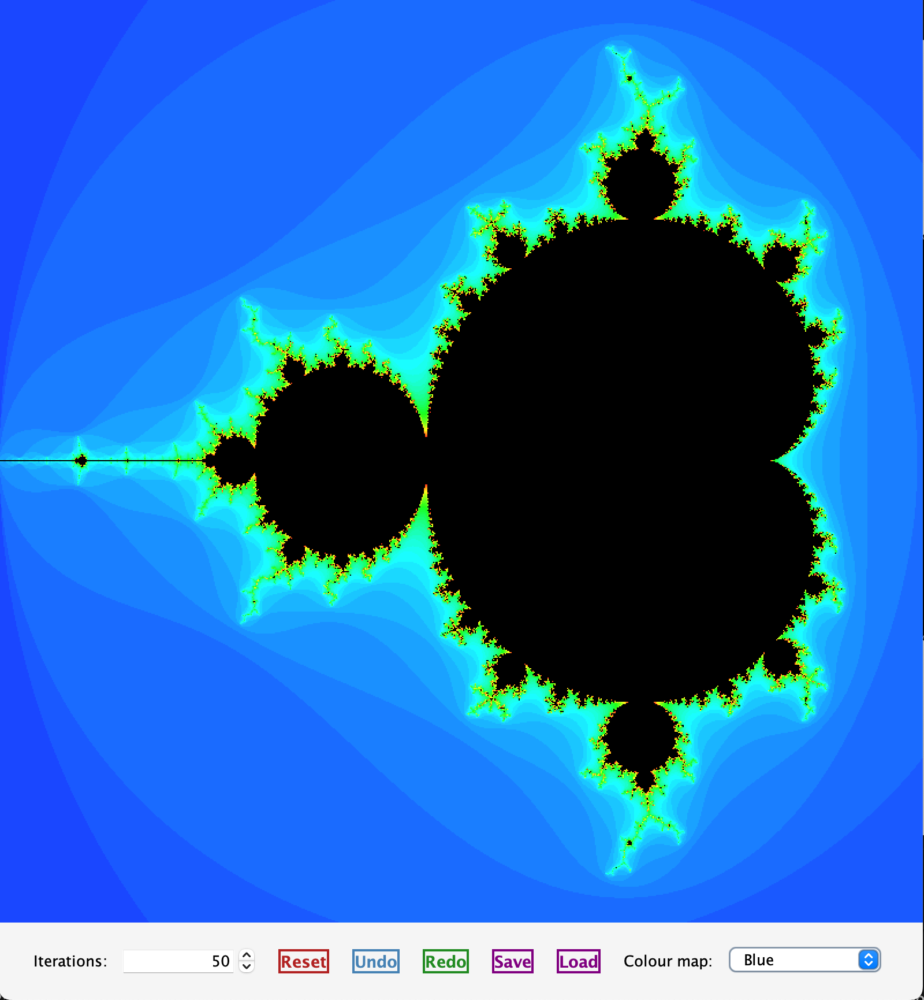

# Mandelbrot Viewer (CS5001 Coursework 3)

An application for exploring the Mandelbrot set.
Features include zooming, panning, undo/redo history, adjustable iteration depth, multiple colour maps, and saving/loading view settings.

## Project Structure

```
.
├── makefile              # Build, test, run, javadoc targets
├── README.md             # Project overview and usage
├── doc/                  # Generated docs and PlantUML diagrams
├── src/
│   ├── controller/       # ControllerMandelbrot (wires UI + model)
│   ├── model/            # ModelMandelbrot, calculator, state, listeners
│   ├── view/             # Swing UI, panels, colour maps, styling
│   └── test/             # JUnit tests for model, controller, view
└── JUnit/                # JUnit standalone jar (test runtime)
```


## **Table of Contents**

1. [Features](#features)
2. [Getting Started](#getting-started)

   * [Commands](#commands)
3. [Architecture (MVC)](#architecture-mvc)

   * [Model](#model--srcmodel)
   * [View](#view--srcview)
        * [UI Preview](#ui-preview)
   * [Controller](#controller--srccontroller)
4. [Test Suite](#test-suite)

   * [Model Tests](#model)
   * [Controller Tests](#controller)
   * [View Tests](#view)


## Features

* Zoom into a user-drawn rectangle
* Pan using Shift + drag or right-click drag
* Undo/Redo full view state
* Selectable colour maps
* Save/Load view configuration
* Adjustable iteration limit
* Swing-based UI with custom styling


## Getting Started

### Commands

* `make run`
  Compiles and launches the app (`view.MandelbrotApp`).

* `make test`
  Compiles and executes the JUnit test suite
  (uses `JUnit/lib-alone/junit-platform-console-standalone-1.13.4.jar`).

* `make compile`
  Compiles all classes into `bin/`.

* `make javadoc`
  Generates API documentation into `doc/`.

* `make clean`
  Removes `bin/` and `doc/`.


## Architecture (MVC)
Aquí tienes una explicación breve, clara y adaptada al tono de tu README. Está pensada para ir **justo debajo del encabezado “Architecture (MVC)”**:

---

## Architecture (MVC)

MVC separates the application into three independent layers:

* **Model:** Manages the data, state, and core logic of the Mandelbrot viewer.
* **View:** Handles all visual representation (UI panels, fractal rendering, controls).
* **Controller:** Interprets user actions (mouse drags, button presses, spinner changes) and updates the Model or View accordingly.


### Model — `src/model`

* `ModelMandelbrot`
  Stores viewport bounds, iteration depth, undo/redo stacks, and active colour map.
  Recalculates the fractal via `MandelbrotCalculator` and notifies listeners with `ModelListener`.
  Supports persistence through `saveToFile` / `loadFromFile`.

* `MandelbrotState`
  Immutable snapshot of all model parameters for undo/redo actions.

* `MandelbrotCalculator`
  Computes iteration counts for each pixel.


### View — `src/view`

* `MandelbrotApp`
  Main application window.

* `MandelbrotPanel`
  Renders the fractal and displays the live zoom rectangle while dragging.

* `ControlPanelMandelbrot`
  UI controls: iteration spinner, undo/redo, reset, save/load, colour map selector.

* Colour Maps:

  * `BlackWhiteColourMap`
  * `BlueColourMap`
    Additional maps can be added by implementing `ColourMap`.

* `UIStyler`
  Applies consistent Swing styling to buttons and UI components.


#### UI Preview

Below are two example renderings of the Mandelbrot Viewer using different colour maps:

**Black & White Colour Map**


**Blue Colour Map**:



### Controller — `src/controller`

* `ControllerMandelbrot`
  Connects user interactions to model operations and manages updates to the view.
  Handles:

  * Mouse zoom rectangle
  * Panning (Shift-drag or right-drag)
  * Iteration changes
  * Undo/redo
  * Save/load
  * Colour map selection
    Model updates automatically trigger view repaints via `ModelListener`.


## Test Suite

### Model

`src/test/model/ModelMandelbrotTest.java`
Validates:

* Reset behaviour
* Undo/redo stack flow
* Panning calculations
* Save/load round-trip consistency
* Listener notification mechanics

### Controller

`src/test/controller/ControllerMandelbrotTest.java`
Ensures UI interactions (spinner updates, colour map selection, Shift-drag panning) correctly call the appropriate model methods with expected parameters.

### View

`src/test/view/ViewMandelbrotTest.java`
Checks:

* `BlueColourMap` produces a smooth gradient
* Safe handling when `maxIterations = 0`

## UML Class Diagram

The following diagram was automatically generated from the project’s source code using **UML Generator**.

You can view the interactive version of the diagram on PlantUML using the link below:


## Author

> Paloma Pérez de Madrid Laguna
